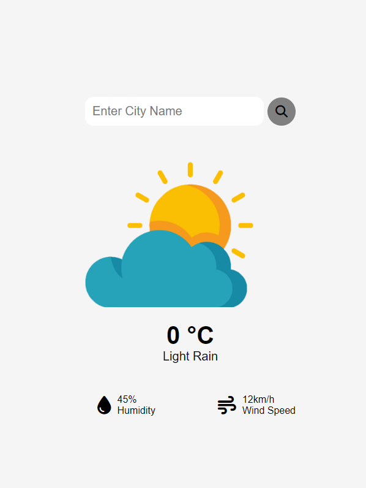

Weather app using html, css and javascript for the Odin project
The user can input their location and the page will display a weather forecast of the area.
Link to webpage: https://berniceu.github.io/weather-app/

webpage screenshot:

